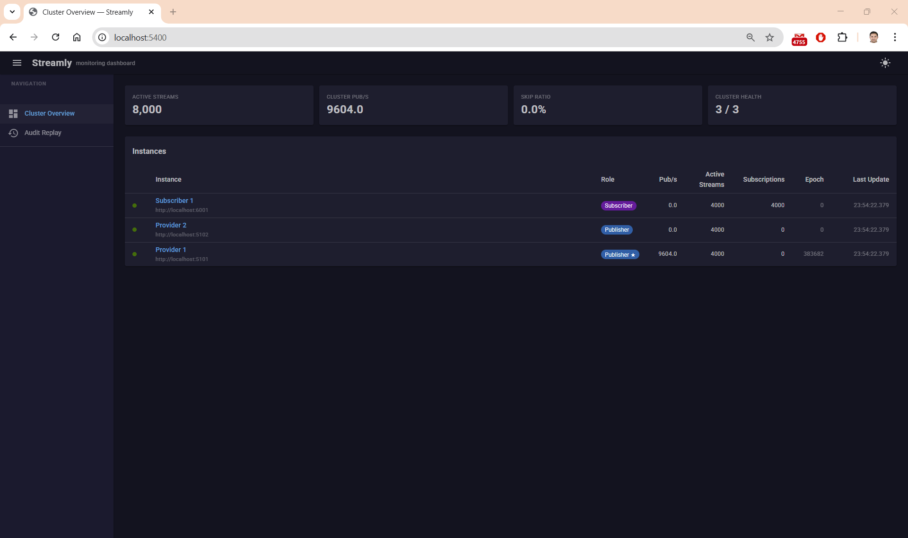
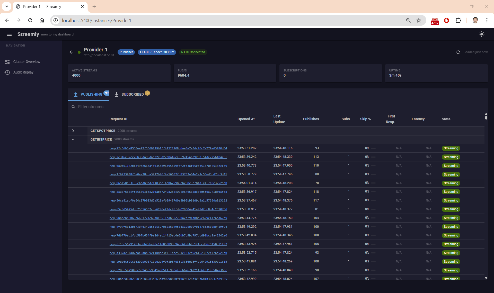
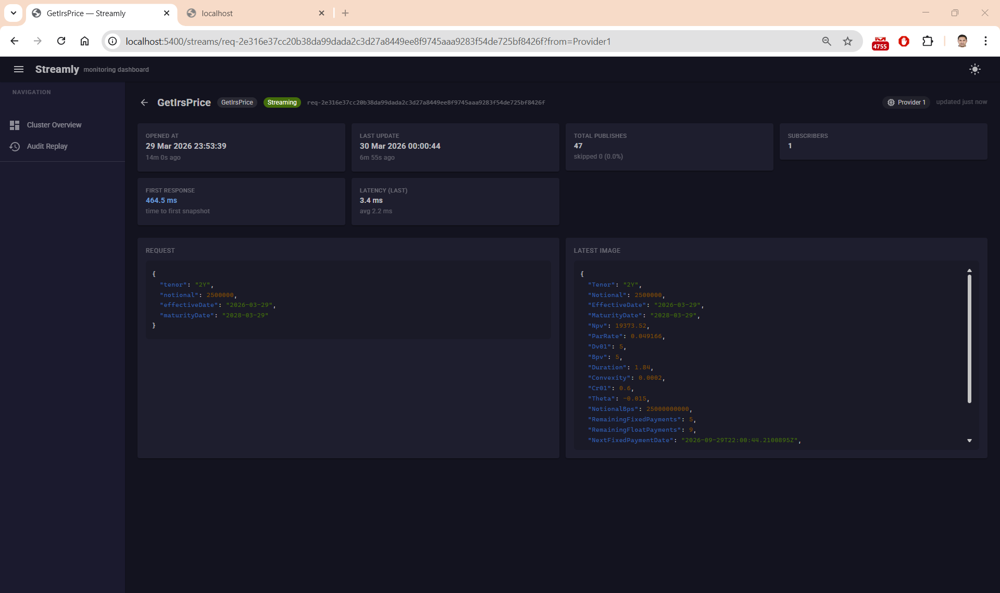
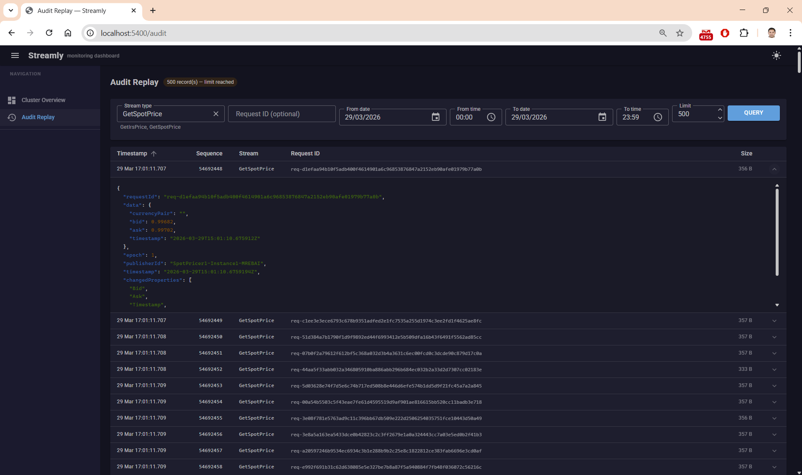

# Streamly

A distributed, real-time streaming library for .NET 9 built on [NATS JetStream](https://docs.nats.io/nats-concepts/jetstream). Streamly enables push-based live data feeds with automatic leader election, transparent subscriber reconnection, and delta compression — with no polling.

> Designed for financial data (FX spot prices, interest rate swaps), but applicable to any real-time feed: IoT telemetry, live dashboards, market data distribution.

---

## Table of Contents

- [Architecture Overview](#architecture-overview)
- [Screenshots](#screenshots)
- [Solution Structure](#solution-structure)
- [Getting Started](#getting-started)
- [Publisher Side](#publisher-side)
- [Subscriber Side](#subscriber-side)
- [Leader Election & Failover](#leader-election--failover)
- [Change Detection & Delta Compression](#change-detection--delta-compression)
- [Monitoring](#monitoring)
- [Audit Trail](#audit-trail)
- [Dashboard](#dashboard)
- [Configuration Reference](#configuration-reference)
- [NuGet Packages](#nuget-packages)
- [Examples](#examples)

---

## Architecture Overview

```
╔══════════════════════════════════════════════════════════════════════╗
║                         NATS  JetStream                              ║
║                                                                      ║
║   streams.requests.*          streams.responses.*                    ║
║   streams.confirmations.*     streams.keepalive.*                    ║
║   KV: STREAMLY_ELECTION_*     audit.*                                ║
╚══════════════╤═══════════════════════╤══════════════════╤════════════╝
               │                       │                  │
    ┌──────────┴──────────┐            │       ┌──────────┴──────────┐
    │                     │            │       │                     │
    ▼                     ▼            ▼       ▼                     ▼
╔═══════════════╗   ╔═══════════════╗      ╔═══════════════════════════╗
║  Publisher A  ║   ║  Publisher B  ║      ║       Subscriber          ║
║               ║   ║               ║      ║                           ║
║  ★ LEADER     ║   ║   FOLLOWER    ║      ║  IStreamingSubscriber<T>  ║
║  ───────────  ║   ║  ───────────  ║      ║  ─────────────────────    ║
║  Runs handler ║   ║  Runs handler ║      ║  Subscribe(request)       ║
║  Publishes    ║   ║  Stays warm   ║      ║  → IObservable<TResponse> ║
║  Renews lock  ║   ║  Auto-promote ║      ║  Auto-reconnect + merge   ║
╚═══════════════╝   ╚═══════════════╝      ╚═══════════════════════════╝
        │                   │                          ▲
        │  < 3s failover    │                          │
        └───────────────────┘              Delta compression + epoch
          KV TTL auto-expiry                    fencing on receive
```

| Concept | Description |
|---------|-------------|
| **Push-based** | Handlers push data continuously — no polling, no request-response |
| **Leader election** | One active publisher at a time via NATS KV atomic lock with TTL |
| **Warm standby** | Followers run handlers and hold latest state, ready to take over in < 3s |
| **Delta compression** | Only changed fields sent over the wire; subscribers merge into a local image |
| **Epoch fencing** | Each term has a monotonically increasing epoch — stale messages from dead leaders are discarded |
| **Transparent reconnect** | Subscribers automatically reconnect with exponential backoff |

---

## Screenshots

### Cluster Overview


### Instance Detail


### Request Detail


### Audit Viewer


---

## Solution Structure

```
Streamly.sln
├── src/
│   ├── Streamly.Core            # Abstractions, models, configuration
│   ├── Streamly.Infrastructure  # NATS transport, leader election, serialization
│   ├── Streamly.Server          # Publisher runtime (handlers, request management)
│   ├── Streamly.Client          # Subscriber runtime (subscriptions, reconnection)
│   ├── Streamly/                # Meta-package (Server + Client)
│   ├── Streamly.Monitoring      # Metrics collection, HTTP endpoints, health probes
│   ├── Streamly.Audit           # Durable audit trail via NATS JetStream
│   └── Streamly.Dashboard       # Blazor + MudBlazor cluster monitoring UI
├── examples/
│   ├── Streamly.FakePublisher   # Example publisher (Spot FX + IRS pricing)
│   └── Streamly.FakeSubscriber  # Example subscriber (Spot FX + IRS)
└── Benchmarks/
    ├── Streamly.Benchmarks      # BenchmarkDotNet performance tests
    └── Streamly.LoadTests       # Load testing suite
```

---

## Getting Started

### Prerequisites

- .NET 9.0 SDK
- A running NATS server with JetStream enabled

```bash
# Run NATS with JetStream locally
docker run -p 4222:4222 nats:latest -js
```

### Installation

Install the packages you need:

```bash
# Full stack (publisher + subscriber)
dotnet add package Streamly

# Publisher only
dotnet add package Streamly.Server

# Subscriber only
dotnet add package Streamly.Client

# Optional add-ons
dotnet add package Streamly.Monitoring
dotnet add package Streamly.Audit
```

### Minimal Setup

**appsettings.json**

```json
{
  "Streamly": {
    "ServiceName": "MyService",
    "Nats": {
      "Url": "nats://localhost:4222"
    }
  }
}
```

**Program.cs (publisher + subscriber in one process)**

```csharp
builder.Services.AddStreamly(builder.Configuration, options =>
{
    options.AddHandler<MyRequest, MyResponse, MyHandler>("GetMyStream");
    options.AddSubscriber<MyRequest, MyResponse>("GetMyStream");
});
```

---

## Publisher Side

### Implementing a Handler

```csharp
public class SpotPricingHandler : IStreamingRequestHandler<SpotRequest, SpotPrice>
{
    public async Task OnRequestOpenedAsync(
        SpotRequest request,
        IStreamingContext<SpotPrice> context,
        CancellationToken cancellationToken)
    {
        while (!cancellationToken.IsCancellationRequested)
        {
            var price = ComputePrice(request.CurrencyPair);
            await context.PublishAsync(price, cancellationToken);
            await Task.Delay(300, cancellationToken);
        }
    }

    public Task OnRequestClosingAsync(
        SpotRequest request,
        CloseReason reason,
        CancellationToken cancellationToken)
    {
        // Cleanup resources, log, etc.
        return Task.CompletedTask;
    }
}
```

### Registering Handlers

```csharp
// Publisher-only setup
builder.Services.AddStreamlyServer(builder.Configuration, options =>
{
    options.AddHandler<SpotRequest, SpotPrice, SpotPricingHandler>("GetSpotPrice");
    options.AddHandler<IrsRequest, IrsResponse, SwapPricingHandler>("GetIrsPrice");

    // With a custom diff computer
    options.AddHandler<MyRequest, MyResponse, MyHandler, MyDiffComputer>("GetMyStream");
});
```

### Stream Behaviors

| Behavior | Description |
|----------|-------------|
| `StreamBehavior.Live` | Continuous stream. Stays open until all subscribers unsubscribe, error, timeout, or shutdown. |
| `StreamBehavior.Snapshot` | One response then auto-close. Framework closes the stream after the first `PublishAsync`. |

### Streaming Context

`IStreamingContext<TResponse>` is injected into `OnRequestOpenedAsync`:

| Member | Description |
|--------|-------------|
| `RequestId` | Unique identifier for this subscription |
| `StreamBehavior` | Live or Snapshot |
| `PublishAsync(response)` | Push a response update to all subscribers |
| `CloseAsync(reason)` | Explicitly close the stream |

### Close Reasons

| Value | Meaning |
|-------|---------|
| `Normal` | Graceful completion |
| `Unsubscribe` | All subscribers unsubscribed |
| `Error` | Handler threw an exception |
| `Timeout` | Request timed out |
| `Orphaned` | No subscriber heartbeats detected (client crash) |
| `Shutdown` | Service is shutting down |

---

## Subscriber Side

### Subscribing to a Stream

```csharp
public class SpotSubscriberWorker(
    IStreamingSubscriber<SpotRequest, SpotPrice> subscriber,
    ILogger<SpotSubscriberWorker> logger) : BackgroundService
{
    protected override async Task ExecuteAsync(CancellationToken stoppingToken)
    {
        var sub = subscriber
            .Subscribe(
                new SpotRequest { CurrencyPair = "EUR/USD" },
                behavior: StreamBehavior.Live,
                onStatusChanged: status =>
                {
                    if (status.State == StreamState.Reconnecting)
                        logger.LogWarning("Stream lost, reconnecting… (attempt {N})", status.RetryAttempt);
                    else if (status.State == StreamState.Active)
                        logger.LogInformation("Stream active");
                    else if (status.State == StreamState.Failed)
                        logger.LogError("Stream permanently failed: {Msg}", status.Message);
                })
            .Subscribe(
                onNext: price => logger.LogTrace("EUR/USD Bid={Bid:F5}", price.Bid),
                onError: ex  => logger.LogError(ex, "Stream error"),
                onCompleted: ()  => logger.LogDebug("Stream closed"));

        await stoppingToken.WaitHandle.ToTask();
        sub.Dispose();
    }
}
```

### Registration

```csharp
// Subscriber-only setup
builder.Services.AddStreamlyClient(builder.Configuration, options =>
{
    options.AddSubscriber<SpotRequest, SpotPrice>("GetSpotPrice");
    options.AddSubscriber<IrsRequest, IrsResponse>("GetIrsPrice");
});
```

### Stream States

| State | Description |
|-------|-------------|
| `Active` | Receiving data normally |
| `Reconnecting` | Lost publisher connection, retrying with exponential backoff |
| `Failed` | All retry attempts exhausted |

### Reconnection Behaviour

- Automatic retry on lost connection or publisher restart
- Exponential backoff starting at `ReconnectInitialDelayMs`
- Stops after `MaxReconnectAttempts` (configure to `-1` for infinite)
- `onStatusChanged` callback fires on every state transition

---

## Leader Election & Failover

Streamly uses NATS JetStream Key-Value store for distributed leader election:

1. **Acquisition** — Every publisher races to `CreateAsync` on a shared KV key. Only one succeeds (atomic).
2. **Renewal** — The leader renews its lock every `HeartbeatIntervalMs` via `UpdateAsync` with the exact last revision (optimistic concurrency). If another instance has taken over, the renewal fails and the stale leader self-demotes.
3. **Expiry** — The KV key has a TTL (`LeaderLockTtl`). If the leader crashes without releasing, the key expires and followers immediately race to elect a new leader.
4. **Fencing** — Each leadership term uses the KV revision as its epoch. Messages carry the epoch; stale messages from dead leaders are silently dropped by subscribers.

**Split-brain prevention**: `UpdateAsync` requires the exact last revision. A paused-then-resumed ex-leader cannot silently overwrite a new leader.

**Failover time**: typically < 3 seconds (configurable via `DeadThresholdMs` + `LeaderLockTtl`).

---

## Change Detection & Delta Compression

By default, Streamly uses `DefaultResponseDiffComputer<T>` which serializes responses to JSON and sends the full payload.

To reduce bandwidth, implement `IResponseDiffComputer<TResponse>`:

```csharp
public class SpotPriceDiffComputer : IResponseDiffComputer<SpotPrice>
{
    public ResponseDiff Compute(SpotPrice? previous, SpotPrice current)
    {
        if (previous == null)
            return ResponseDiff.Full(Serialize(current));

        var delta = new SpotPriceDelta();
        if (previous.Bid != current.Bid) delta.Bid = current.Bid;
        if (previous.Ask != current.Ask) delta.Ask = current.Ask;

        return delta.HasChanges
            ? ResponseDiff.Delta(Serialize(delta))
            : ResponseDiff.NoChange();
    }
}
```

Register it alongside your handler:

```csharp
options.AddHandler<SpotRequest, SpotPrice, SpotPricingHandler, SpotPriceDiffComputer>("GetSpotPrice");
```

Subscribers automatically merge deltas into their local image.

---

## Monitoring

Streamly.Monitoring adds in-process metrics collection and HTTP endpoints to any publisher or subscriber service.

### Registration

```csharp
builder.Services.AddStreamlyMonitoring(options =>
{
    options.InstanceId   = "pub-1";
    options.InstanceRole = "Publisher"; // "Publisher", "Subscriber", or "Both"
    options.RetainClosedStreamsFor = TimeSpan.FromSeconds(5);
    options.PublishRateWindow      = TimeSpan.FromSeconds(10);
    options.RoutePrefix            = "/streamly"; // default
});

// Map HTTP endpoints
app.MapStreamlyEndpoints();
```

### HTTP Endpoints

| Endpoint | Description |
|----------|-------------|
| `GET /streamly/health` | Liveness / readiness probe |
| `GET /streamly/metrics` | Metrics snapshot (JSON or `?format=prometheus`) |
| `GET /streamly/streams` | Active stream table |
| `GET /streamly/streams/{requestId}` | Single stream detail |
| `GET /streamly/audit` | Audit record query (requires Streamly.Audit) |

### Tracked Metrics

- Active stream count
- Publish rate (per second, rolling window)
- Skip ratio (unchanged responses skipped)
- Active subscription count
- Leader state and current epoch

---

## Audit Trail

Streamly.Audit records every published response to a durable NATS JetStream stream, enabling time-range replay and historical queries.

### Registration

```csharp
// On the publisher (writes + reads)
builder.Services.AddStreamlyAudit(options =>
{
    options.RetentionDays = 14;
    options.MaxStorageGb  = 10;
    options.StreamReplicas = 1;
});

// On a read-only service (e.g., Dashboard)
builder.Services.AddStreamlyAuditReader(options => { ... });
```

### Querying Audit Records

```csharp
public class AuditService(IAuditReader auditReader)
{
    public async Task<IEnumerable<AuditRecord>> GetHistoryAsync(
        string streamName,
        DateTimeOffset from,
        DateTimeOffset to)
    {
        return await auditReader.QueryAsync(streamName, from, to);
    }
}
```

**AuditRecord fields**: `RequestId`, `StreamName`, `Timestamp`, `Sequence`, `Payload` (raw bytes).

---

## Dashboard

Streamly.Dashboard is a Blazor Server web application (MudBlazor) that provides a real-time cluster monitoring UI.

### Features

- **Cluster overview** — All instances, their roles, metrics, and health at a glance
- **Instance detail** — Per-instance stream table, pub rate, leadership status, epoch
- **Live updates** — SignalR hub pushes metric changes without page refresh
- **Audit viewer** — Query historical responses by time range

### Setup

```json
// appsettings.json (Dashboard)
{
  "Streamly": {
    "Dashboard": {
      "Instances": [
        { "Id": "pub-1", "Label": "Publisher 1", "BaseUrl": "http://localhost:5001" },
        { "Id": "pub-2", "Label": "Publisher 2", "BaseUrl": "http://localhost:5002" }
      ],
      "PollIntervalMs": 2000
    }
  }
}
```

The dashboard polls each registered instance's `/streamly/metrics` endpoint and aggregates results in real time.

---

## Configuration Reference

### Streamly (root)

| Key | Default | Description |
|-----|---------|-------------|
| `ServiceName` | *(required)* | Logical service name used for NATS subjects |
| `InstanceId` | `{ServiceName}-{MachineName}` | Unique identifier for this process instance |
| `SubscriberHeartbeatTimeoutMs` | `10000` | Time before a silent subscriber is considered orphaned |
| `PublisherHeartbeatIntervalMs` | `500` | How often keepalive messages are sent to Live stream subscribers |

### Streamly:LeaderElection

| Key | Default | Description |
|-----|---------|-------------|
| `HeartbeatIntervalMs` | `100` | How often the leader renews its KV lock |
| `DeadThresholdMs` | `1000` | How long without a heartbeat before a leader is considered dead |

### Streamly:StateSync

| Key | Default | Description |
|-----|---------|-------------|
| `BatchSyncIntervalMs` | `15000` | How often the leader broadcasts all active requests to followers |

### Streamly:Subscriber

| Key | Default | Description |
|-----|---------|-------------|
| `ConfirmationTimeoutMs` | `10000` | How long to wait for a subscription confirmation |
| `DispatchWorkerCount` | `ProcessorCount` | Number of parallel response dispatch workers |
| `DispatchChannelCapacity` | `10000` | Backpressure channel size per stream |
| `MaxReconnectAttempts` | `60` | Max reconnect attempts before failing permanently |
| `ReconnectInitialDelayMs` | `1000` | Starting delay for exponential backoff |

### Streamly:Nats

| Key | Default | Description |
|-----|---------|-------------|
| `Url` | *(required)* | NATS server URL(s), comma-separated for clusters |
| `ConnectionName` | `"Streamly"` | Connection label visible in NATS monitoring |
| `MaxReconnectAttempts` | `-1` | `-1` = unlimited reconnects (recommended for production) |
| `ReconnectWait` | `2s` | Base delay between NATS reconnect attempts |
| `LeaderLockTtl` | `3s` | Leader KV key TTL — auto-expiry on crash |
| `Username` / `Password` | *(optional)* | NATS authentication credentials |
| `CredentialsFile` | *(optional)* | Path to NATS `.creds` file (alternative to user/pass) |

---

## NuGet Packages

| Package | Description |
|---------|-------------|
| `Streamly` | Meta-package (Server + Client). Use this for services that both publish and subscribe. |
| `Streamly.Server` | Publisher runtime only |
| `Streamly.Client` | Subscriber runtime only |
| `Streamly.Core` | Abstractions and models (for custom implementations) |
| `Streamly.Infrastructure` | NATS transport and leader election |
| `Streamly.Monitoring` | Metrics collection and HTTP endpoints |
| `Streamly.Audit` | Durable audit trail |

Current version: `0.1.0` · License: MIT · Author: Moez REBAI (JoYa)

---

## Examples

The `examples/` folder contains two runnable projects that demonstrate a complete Streamly setup:

### Streamly.FakePublisher

Simulates two live pricing streams:
- **GetSpotPrice** — FX spot prices (EUR/USD, GBP/USD, etc.) updated every 300 ms
- **GetIrsPrice** — Interest rate swap prices updated every 500 ms

Includes Monitoring and Audit registration. Run two instances simultaneously to observe leader election and failover.

```bash
cd examples/Streamly.FakePublisher
dotnet run
```

### Streamly.FakeSubscriber

Subscribes to both pricing streams using `BackgroundService` workers:
- **SpotSubscriberWorker** — Subscribes to N currency pairs concurrently
- **SwapSubscriberWorker** — Subscribes to N swap instruments concurrently

Logs first response latency, reconnection events, and stream lifecycle.

```bash
cd examples/Streamly.FakeSubscriber
dotnet run
```

### Running the Full Stack

```bash
# Terminal 1 — NATS
docker run -p 4222:4222 nats:latest -js

# Terminal 2 — Publisher instance 1
cd examples/Streamly.FakePublisher && dotnet run

# Terminal 3 — Publisher instance 2 (follower, ready for failover)
cd examples/Streamly.FakePublisher && dotnet run -- --urls http://localhost:5002

# Terminal 4 — Subscriber
cd examples/Streamly.FakeSubscriber && dotnet run
```

Stop the first publisher (Ctrl+C) and observe the follower take over within 3 seconds with no subscriber interruption.
